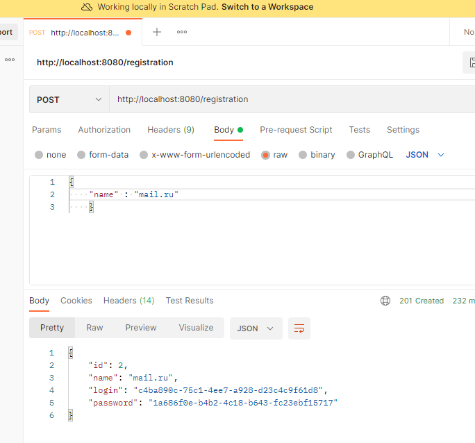
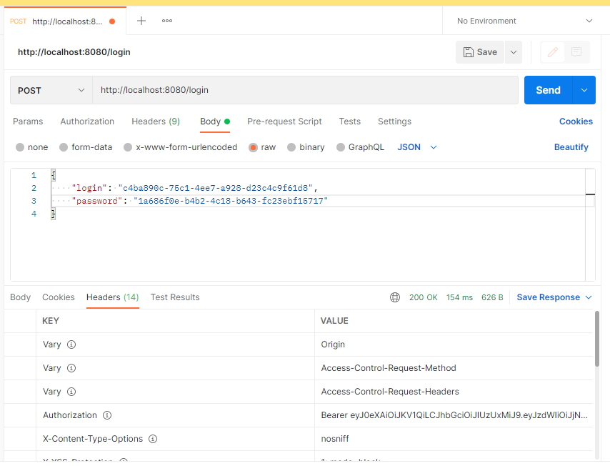
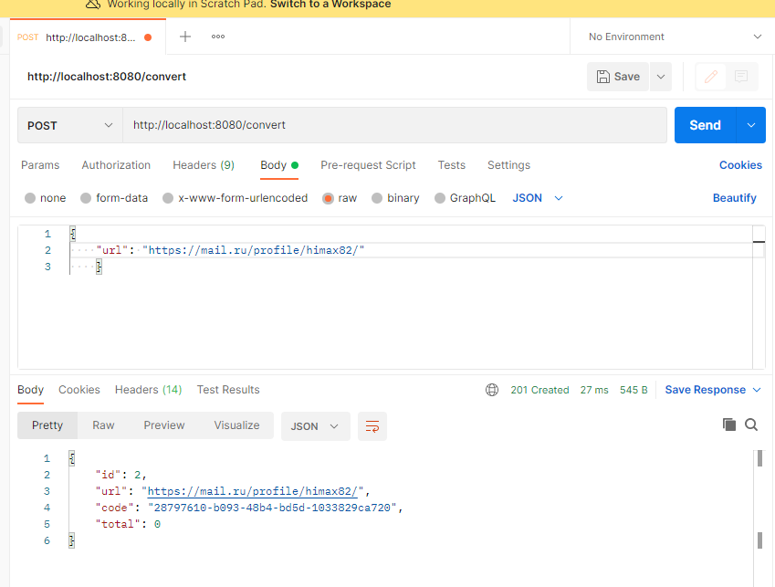
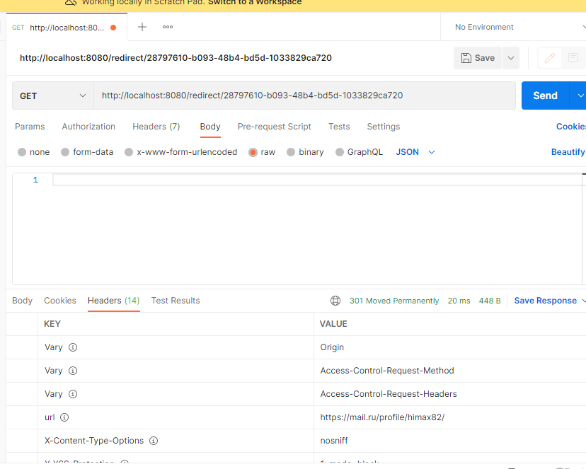
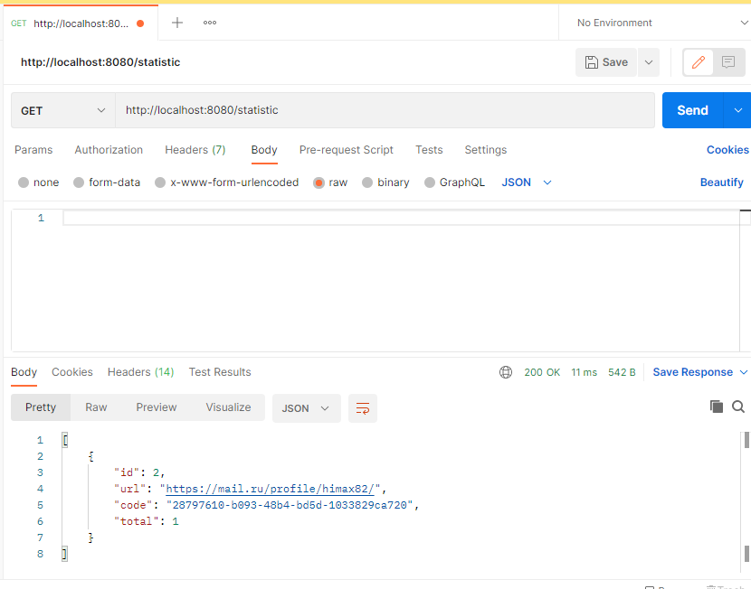

]

### Описание проекта
Сервис позволяет обеспечить безопасность пользователей на сайте заменяя обычные ссылки на преобразованные. Проект представляет собой так же сервис для сбора статистики посещений страниц для различных сайтов, зарегистрированных в системе. Это веб-приложение реализует принцип архитектуры RESTful.

### Использованные технологии

<ul>
<li>Java 14</li>
<li>Spring Security & JWT authorization</li>
<li>Spring Boot 2</li>
<li>Spring Data JPA</li>
<li>PostgreSQL</li>
<li>Liquibase</li>
<li>Maven</li>
<li>Travis C.I.</li>
<li>Checkstyle</li>
<li>Jacoco</li>
</ul>

### Методы API

<ul>
<li>Регистрация сайта в сервисе. POST: /registration</li>

<li>Авторизация. POST: /login</li>

<li>Конвертировать ссылку в код. POST: /convert</li>

<li>Получить ссылку по коду. GET: /redirect/{code}</li>

<li>Получитб статистику по ссылкам. GET: /statistic</li>

</ul>